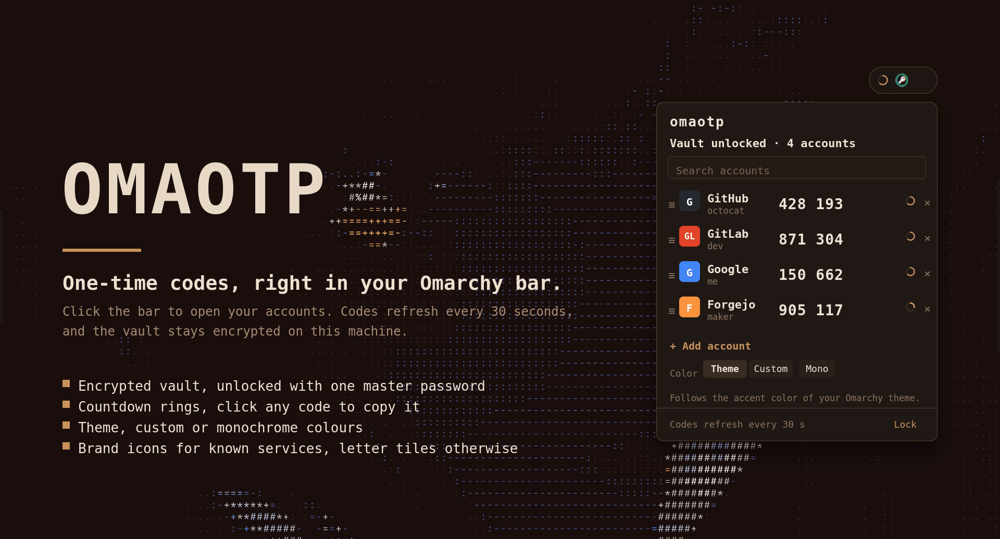

# omaotp

A FreeOTP-style authenticator for the Omarchy bar. The bar shows one icon, ringed by its countdown, for the first account in your list. You set that order by dragging. Click the bar to open the list, search it, copy any code with one click, and drag accounts into the order you want.

Codes are RFC 6238 TOTP, the same codes FreeOTP, Aegis and Google Authenticator produce. Secrets are stored in an encrypted vault on this machine, protected by a master password.



## Install

```sh
omarchy plugin add https://github.com/qempexe/omarchy-omaotp.git --enable --yes
```

On first open, create a vault with a master password of at least 8 characters. The vault is created automatically; there is no separate setup step.

## Requirements

| Tool | Used for | Usually installed |
| --- | --- | --- |
| `python3` | the helper that generates codes | yes |
| `openssl` | encrypting the vault | yes |
| `wl-clipboard` (`wl-copy`, `wl-paste`) | copying codes | yes on Omarchy |

## Using it

* **Add an account:** open the panel, click *Add account*, then either paste an `otpauth://totp/...` link (from a QR code decoder or the site's setup page) or fill in issuer, account and secret.
* **Copy a code:** click its row. The clipboard is cleared 30 seconds later if it still holds that code.
* **Search:** type in the search box to filter by issuer or account.
* **Reorder:** press and drag the `≡` handle on the left of a row, then release it over the row you want. The new order is saved in the vault, and the account at the top of the list is the one shown in the bar.
* **Remove an account:** click the `×` on its row, then click *Remove?* to confirm.
* **Lock:** click *Lock* in the footer or middle-click the widget. The vault also locks 5 minutes after the panel closes.

Codes refresh every 30 seconds, when the time window changes.

## Color

Choose the color in the panel's *Color* row:

| Mode | What it uses |
| --- | --- |
| **Theme** (default) | The accent color from your current Omarchy theme. Follows theme changes within a minute. |
| **Custom** | Any `#rrggbb` color. Pick a swatch, type a hex value and press Enter, or click Reset. |
| **Mono** | Shades of your bar text color. Good for a fully neutral bar. |

Countdown warnings are always shown in yellow (10 seconds left) and red (5 seconds left), in every mode.

The theme mode reads `accent` from `~/.config/omarchy/current/theme/colors.toml`. If your theme uses a different file or key, the widget falls back to its default green. The fix is in `bin/theme-accent.sh`.

## Where data lives

| Path | Contents |
| --- | --- |
| `~/.local/share/omaotp/vault.enc` | encrypted vault (AES-256-CBC, PBKDF2-SHA256, 300,000 iterations) |
| `~/.config/omaotp/color` | `theme`, `mono`, or a `#rrggbb` color |

Nothing secret is written to the shell settings file or to the log.

## Security notes

* The master password is never passed on the command line. It goes to the helper on stdin and from there to openssl through a pipe, so it does not show up in `ps`.
* The password and decrypted codes are held in memory only while the vault is open. Locking clears them.
* The QML makes no network requests. Everything runs locally.
* Back up `vault.enc` and remember the master password. Without the password the vault cannot be recovered.

## Limitations

* No import yet from Aegis or FreeOTP exports. Add accounts by link or by hand for now.
* No QR scanning from the screen yet.
* Only 30-second periods are shown as expected. Other periods work but refresh at the shortest period across your accounts.
* Month and weekday labels are English.

## Development

```
manifest.json          plugin manifest (id, settings schema)
BarWidget.qml          bar item: vault state, helper job queue, countdown ring
Panel.qml              popout: setup, unlock, account list, add, color
Otp.js                 shared model: errors, issuer icons, colors, parsing
bin/omaotp.py          helper: encrypted vault, TOTP, otpauth parsing
bin/theme-accent.sh    reads the Omarchy theme accent
assets/key.png          icon shown in the bar for accounts with no known brand icon
```

The helper's commands are `status`, `init`, `codes`, `add` and `remove`. Each prints one line of JSON. Test it on its own with:

```sh
printf 'my master password\n' | python3 bin/omaotp.py codes
```

## License

MIT
